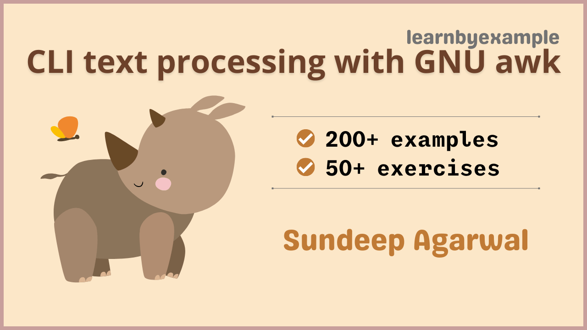

# CLI text processing with GNU awk

Example based guide to mastering GNU awk. Visit https://youtu.be/KIa_EaYwGDI for a short video about the book.

The book also includes exercises to test your understanding, which are presented together as a single file in this repo — [Exercises.md](./exercises/Exercises.md).

For solutions to the exercises, see [Exercise_solutions.md](./exercises/Exercise_solutions.md).

You can also use [this interactive TUI app](https://github.com/learnbyexample/TUI-apps/blob/main/AwkExercises) to practice some of the exercises from the book.

See [Version_changes.md](./Version_changes.md) to keep track of changes made to the book.

 

# E-book

* You can purchase the pdf/epub versions of the book using these links:
    * https://learnbyexample.gumroad.com/l/gnu_awk
    * https://leanpub.com/gnu_awk
* You can also get the book as part of these bundles:
    * **All books bundle** bundle from https://learnbyexample.gumroad.com/l/all-books
        * Includes all my programming books
    * **Magical one-liners** bundle from https://learnbyexample.gumroad.com/l/oneliners or https://leanpub.com/b/oneliners
    * **Awesome Regex** bundle from https://learnbyexample.gumroad.com/l/regex or https://leanpub.com/b/regex
* See https://learnbyexample.github.io/books/ for a list of other books

For a preview of the book, see [sample chapters](./sample_chapters/gnu_awk_sample.pdf).

The book can also be [viewed as a single markdown file in this repo](./gnu_awk.md). See my blogpost on [generating pdfs from markdown using pandoc](https://learnbyexample.github.io/customizing-pandoc/) if you are interested in the ebook creation process.

For the web version of the book, visit https://learnbyexample.github.io/learn_gnuawk/

 

# Testimonials

>Step up your cli fu with this fabulous intro & deep dive into awk. I learned a ton of tricks!
>
> — [feedback on twitter](https://twitter.com/killchain/status/1246820137455452163)

>I consider myself pretty experienced at shell-fu and capable of doing most things I set out to achieve in either bash scripts or fearless one-liners. However, my awk is rudimentary at best, I think mostly because it's such an unforgiving environment to experiment in.
>
>These books you've written are great for a bit of first principles insight and then quickly building up to functional usage. I will have no hesitation in referring colleagues to them!
>
> — [feedback on Hacker News](https://news.ycombinator.com/item?id=31930840)

 

# Feedback and Contributing

⚠️ ⚠️ Please DO NOT submit pull requests. Main reason being any modification requires changes in multiple places.

I would highly appreciate it if you'd let me know how you felt about this book. It could be anything from a simple thank you, pointing out a typo, mistakes in code snippets, which aspects of the book worked for you (or didn't!) and so on. Reader feedback is essential and especially so for self-published authors.

You can reach me via:

* Issue Manager: [https://github.com/learnbyexample/learn_gnuawk/issues](https://github.com/learnbyexample/learn_gnuawk/issues)
* E-mail: `echo 'bGVhcm5ieWV4YW1wbGUubmV0QGdtYWlsLmNvbQo=' | base64 --decode`
* Twitter: [https://twitter.com/learn_byexample](https://twitter.com/learn_byexample)

 

# Table of Contents

1) Preface
2) Installation and Documentation
3) awk introduction
4) Regular Expressions
5) Field separators
6) Record separators
7) In-place file editing
8) Using shell variables
9) Control Structures
10) Built-in functions
11) Multiple file input
12) Processing multiple records
13) Two file processing
14) Dealing with duplicates
15) awk scripts
16) Gotchas and Tips
17) Further Reading

 

# Acknowledgements

* [GNU awk documentation](https://www.gnu.org/software/gawk/manual/) — manual and examples
* [stackoverflow](https://stackoverflow.com/) and [unix.stackexchange](https://unix.stackexchange.com/) — for getting answers to pertinent questions on `awk` and related commands
* [tex.stackexchange](https://tex.stackexchange.com/) — for help on [pandoc](https://github.com/jgm/pandoc/) and `tex` related questions
* [/r/commandline/](https://old.reddit.com/r/commandline), [/r/linux4noobs/](https://old.reddit.com/r/linux4noobs/), [/r/linuxquestions/](https://old.reddit.com/r/linuxquestions/) and [/r/linux/](https://old.reddit.com/r/linux/) — helpful forums
* [canva](https://www.canva.com/) — cover image
* [oxipng](https://github.com/shssoichiro/oxipng), [pngquant](https://pngquant.org/) and [svgcleaner](https://github.com/RazrFalcon/svgcleaner) — optimizing images
* [Warning](https://commons.wikimedia.org/wiki/File:Warning_icon.svg) and [Info](https://commons.wikimedia.org/wiki/File:Info_icon_002.svg) icons by [Amada44](https://commons.wikimedia.org/wiki/User:Amada44) under public domain
* [arifmahmudrana](https://github.com/arifmahmudrana) for spotting an ambiguous explanation
* [Pound-Hash](https://github.com/Pound-Hash) for critical feedback
* [mdBook](https://github.com/rust-lang/mdBook) — for web version of the book
    * [mdBook-pagetoc](https://github.com/JorelAli/mdBook-pagetoc) — for adding table of contents for each chapter
    * [minify-html](https://github.com/wilsonzlin/minify-html) — for minifying html files

Special thanks to all my friends and online acquaintances for their help, support and encouragement, especially during these difficult times.

 

# License

The book is licensed under a [Creative Commons Attribution-NonCommercial-ShareAlike 4.0 International License](https://creativecommons.org/licenses/by-nc-sa/4.0/).

The code snippets are licensed under MIT, see [LICENSE](./LICENSE) file.

